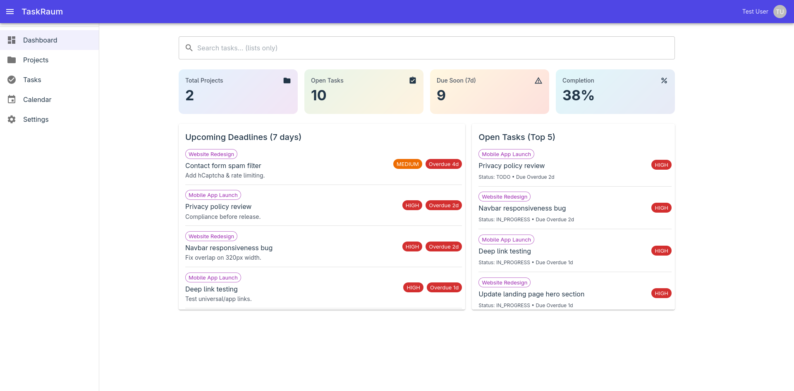
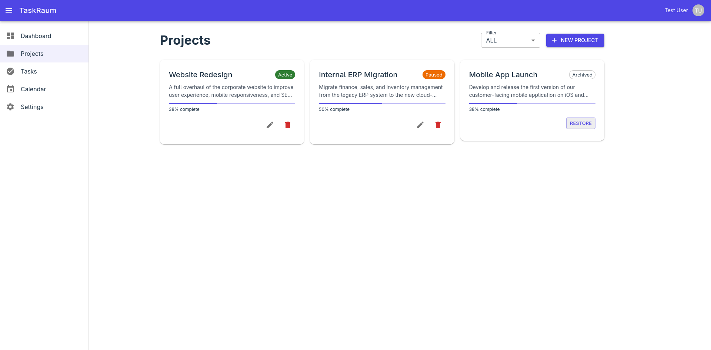
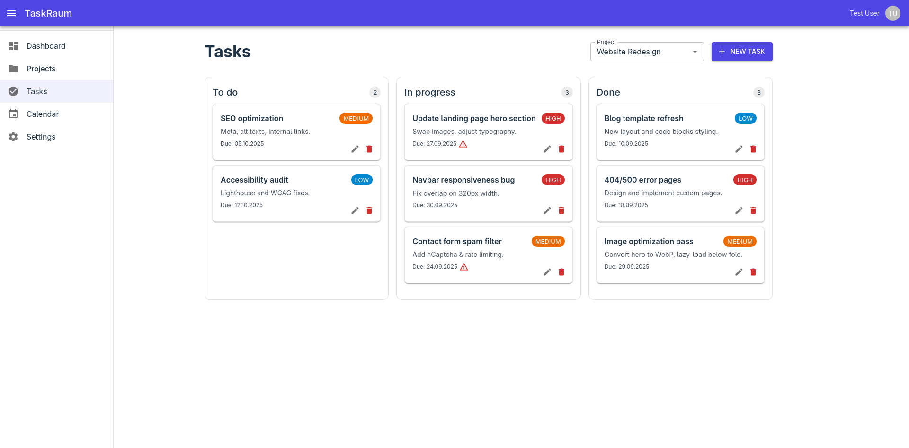
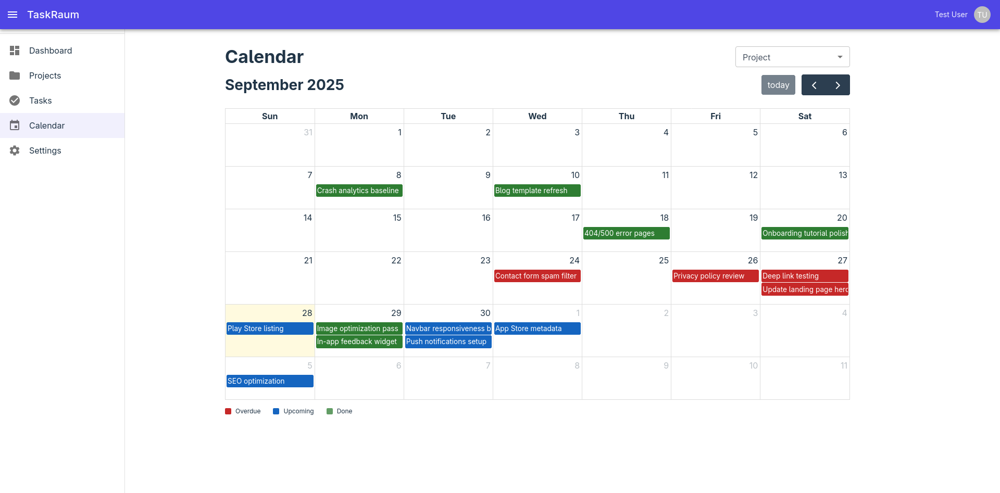
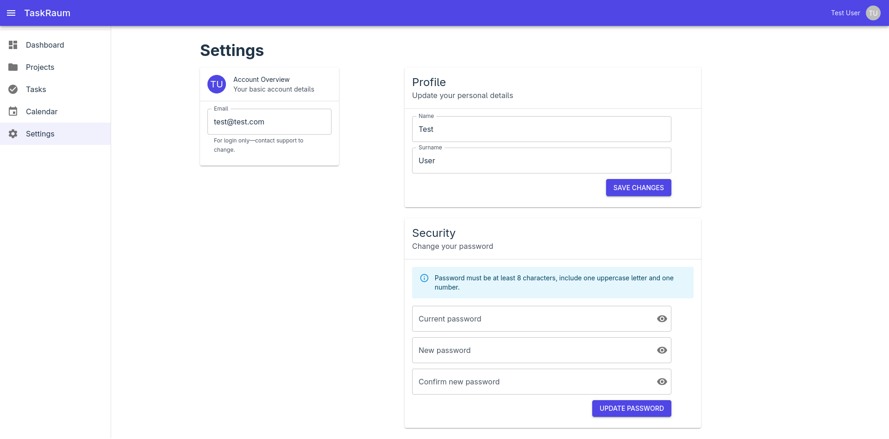

# TaskRaum

- TaskRaum is task and project management web app and built as a **Capstone Project** during the [Java Development Bootcamp by neue fische GmbH](https://www.neuefische.de/bootcamp/java-development)  
- Designed primarily for **single-user usage**, with roadmap toward multi-user support  
- Developed in **4 weeks** using **Spring Boot (Java)** (backend) and **React + TypeScript** (frontend)

> 🌐 **Live Demo:** [https://taskraum.onrender.com](https://taskraum.onrender.com)

---

## ✨ Features
- **Projects:** create, edit, pause, archive, or restore projects.
- **Tasks:** kanban board with drag-and-drop; statuses auto-update on move.
- **Calendar:** monthly view with overdue, upcoming, and done tasks; drag-and-drop rescheduling.
- **Dashboard:** statistics (open tasks, deadlines, completion %).
- **Settings:** update profile or change password (new ≠ old).
- **Authentication:** JWT-based login/registration with refresh support.

---

## 🛠 Tech Stack

### Backend
- Java 21, Spring Boot, Spring Security, JJWT
- MongoDB Atlas (prod) / Docker Mongo (tests)
- Lombok, Jacoco, GitHub Actions (CI/CD)
- Deployed via Docker on **Render**

### Frontend
- React + TypeScript (Vite)
- Material UI, Zustand
- React Hook Form + Zod
- Axios, React Router
- DnD & FullCalendar

---

## ⚙️ Installation

### Requirements
- Java 21, Node.js 22, npm 10

### Environment Variables
- `JWT_SECRET` – secret key for JWT signing
- `MONGODB_URI` – MongoDB connection string (Atlas used for live demo)

### Setup
```bash
# Clone the repository
git clone https://github.com/emrullaharac/TaskRaum.git
cd TaskRaum

# Backend setup
cd backend
./mvnw clean install

# Frontend setup
cd frontend
npm install
```

---

## 🚀 Usage

### Local Development
```bash
# backend
cd backend
./mvnw spring-boot:run

# frontend
cd frontend
npm run dev
```

### Production (current pipeline)
- GitHub Actions builds the frontend into `backend/src/main/resources/static`.
- Backend is packaged as a JAR.
- Docker image is built and deployed to Render.

---

## 🏗 Architecture

### Frontend Structure (key files)
```txt
src
├── api/              # axios client & API modules
├── app/              # App root & providers (router, theme)
├── components/       # layout, app bar, common components
├── features/         # auth, dashboard, projects, tasks, calendar, settings
├── pages/            # public pages (Home, Auth, About, NotFound)
├── store/            # zustand stores
├── types/            # DTOs, normalizers, axios.d.ts
└── main.tsx, index.css
```

### Backend Structure (key packages)
```txt
src/main/java/dev/taskraum/backend
├── auth/             # controllers & DTOs for auth
├── common/           # errors, enums, global exception handler
├── config/           # security, mongo, web config
├── projects/         # project domain (controller, service, repo, DTOs)
├── security/         # JWT util & filter, principal
├── tasks/            # task domain (controller, service, repo, DTOs)
└── users/            # profile & user management
src/test/java/dev/taskraum/backend
└── ...               # unit & integration tests mirroring main packages
```

---

## 📡 API Endpoints

### Auth
| Method | Endpoint         | Description              |
|--------|------------------|--------------------------|
| POST   | `/auth/register` | Register new user        |
| POST   | `/auth/login`    | Login and get JWT token  |
| GET    | `/auth/me`       | Get current user info    |
| POST   | `/auth/refresh`  | Refresh access token     |
| POST   | `/auth/logout`   | Logout and clear tokens  |

### Projects
| Method | Endpoint                | Description               |
|--------|-------------------------|---------------------------|
| GET    | `/api/projects`         | List projects (paginated) |
| POST   | `/api/projects`         | Create a new project      |
| GET    | `/api/projects/{id}`    | Get project by ID         |
| PUT    | `/api/projects/{id}`    | Update project            |
| DELETE | `/api/projects/{id}`    | Delete project            |

### Tasks
| Method | Endpoint                                               | Description          |
|--------|--------------------------------------------------------|----------------------|
| GET    | `/api/projects/{projectId}/tasks`                      | List tasks by status |
| POST   | `/api/projects/{projectId}/tasks`                      | Create a new task    |
| PUT    | `/api/tasks/{id}`                                      | Update task          |
| DELETE | `/api/tasks/{id}`                                      | Delete task          |

### Profile
| Method | Endpoint             | Description          |
|--------|----------------------|----------------------|
| PUT    | `/api/me`            | Update profile info  |
| PUT    | `/api/me/password`   | Change password      |

---

## 🖼 Screenshots

### Dashboard

  

### Projects

  

### Tasks



### Calendar

  

### Settings



---

## 📌 Roadmap (Upcoming Updates)
- Multi-user support with invitations.
- Assignees across users and extended dashboard stats.

---

## 👤 Author
**Emrullah Arac**
- GitHub: https://github.com/emrullaharac

---

## 📄 License
Licensed under the [**MIT License**](./LICENSE).
